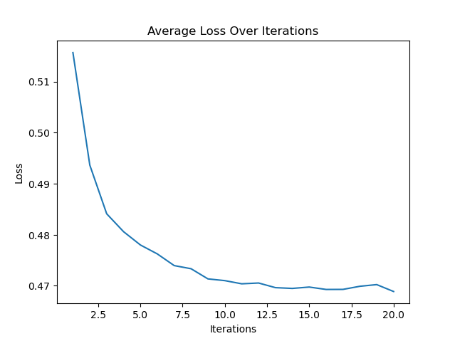
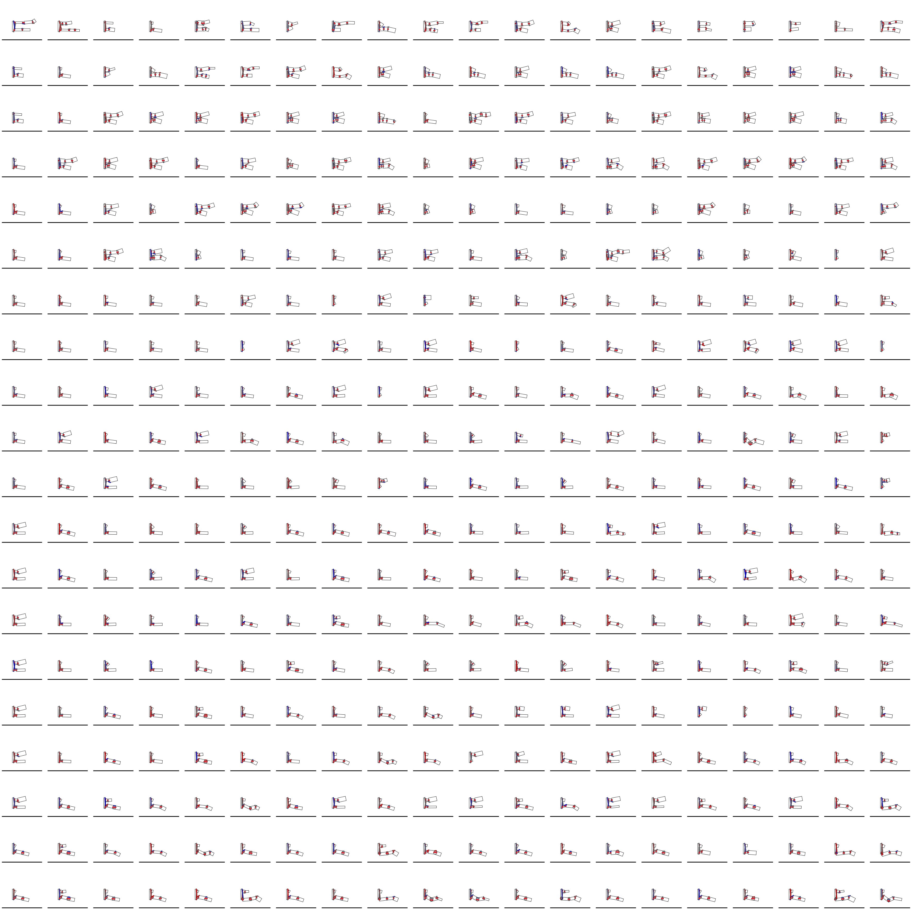

### Evolution of Biological Manipulators 

## Introduction

Human hands are amazingly versatile, capable of performing a wide array of complex tasks ranging from tool use to direct in-hand manipulation. 


## Requirements

This project is based on Taichi Lang and requires the python module.
It can be installed using the pip command below.
For more information on Taichi Lang or their documentation, please see their website: https://www.taichi-lang.org/.

Additionally, this project is based on code provided by DiffTaichi, please see their github here: https://github.com/taichi-dev/difftaichi.

```
pip3 install taichi
```

## Files

There are 5 relevant files in the repository each are explained below, along with important parameters which an be adjusted. 

1. `rigid_finger.py`: This file contains the constructor for the finger strucutre and the palm. There are no variables which need to be modified here unless you are intendeding to alter how the finger is generated. The finger is generated according to the provided inputs, which is the palm size and position, and the list of phalange information which has phalange size and stiffness for each phalange. The final value required is a spring offset which affects the position of the tendons.

2. `rigid_body.py`: This file simulates the provided finger. Upon running, it will attempt to pull from a data.pkl file to generate the physical body of the finger. It will then run the learning process for a number of iterations. It will dump the losses into a losses.pkl for later use. There are several important paramters to be adjusted at the top of the file. Two most important are indicated below. This code is heavily based off the DiffTaichi github. This will visualize the final result and save it to a file called rigid_body/fingers. Each generation and each population member will have it's own file for each timestep. 
- ITERATIIONS: Defines the number of learning iterations, the default is 10.
- n_sin_waves: Defines the numbre of sine_waves in the actuation function, the default is 25.

3. `finger_evolve.py`: This is the main file that you should run to evolve a finger process. This file handles the generation of generations and indiviudals, as well as the evaluation and mutation of the population after learning. There are several important functions and paramaters which can be customized to a user's desired. This file will generate a data.pkl and hand it off to the `rigid_body.py` function to simulate the behavior as well as fetching the generated losses.pkl file. At the end, this file will output a final_losses.pkl which includes the index of the best individual for each generation, the minimum loss for generation, the average loss for each generation, and all losses recorded for later use. Additionally, it will generate a figure of the minimum and average loss across generations.
- The first several functions define how a parameter is sampled to form a random individual. This is currently a uniform distrubition over a user defined range. These functions can be altered to have other forms of sampling if desired.
- The `mutate` function accepts an indivudal and mutates it accordingly. The indnivudal if first deepcopied to avoid any accidental changes to the provided indivudal. A user may alter this to change how the individual are mutated. 
- The `create_individual` function randomly generates and returns an individual using the sampling functions described above.
- The `create_generation` function will return a population of a specified size filled with random individual.
- The `run_generation` function will call `rigid_body.py` to get the losses of each member of a generation. It returns these losses but stores all losses for later. 
- The `purge_replace_population` function evaluates and replaces population members. The defulat setting is to keep the best 30% of the population (evaluated by least loss) and then to mutate these saved members to bring the population up to size.
- The `main` will generate a populaton of a specified size and run for a specified number of generations. Modify this function to alter the population size and the generations


The whole file can be run with the command below. Example plots akin to those it will generate are also shown below

```
python3 finger_evolve.py
```




4. `plotting.py`: This file merges the timeseries plots of all individuals into one image. The four parameters needed to adjust are as follows.
- local_folder: Probably does not need to be changed, unless it was renamed or moved
- final_folder: Where should these images output?
- w: The width of the generated image (# of images)
- h: the height of the generated image (# of images)

The file can be run with the command below. An example generated image is also shown below.'

```
python3 plotting.py
```



5. `video.py`: The file merges all of the `plotting.py` files into a video.avi for viewing. There are two parameters that might need to be changed.
- folder: Where to look for the images
- num_imgs: How many images to merge. Unless you change the timespan of the simulation, this is constant. 


The file can be run with the command shown below. Several example videos are also shown below.

```
python3 video.py
```


